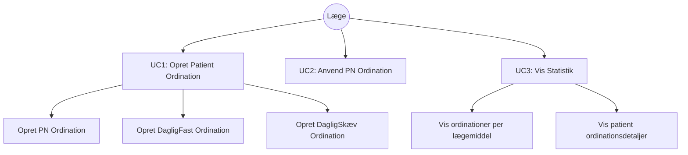
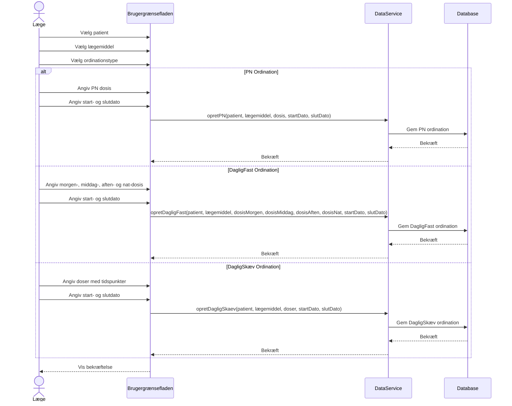
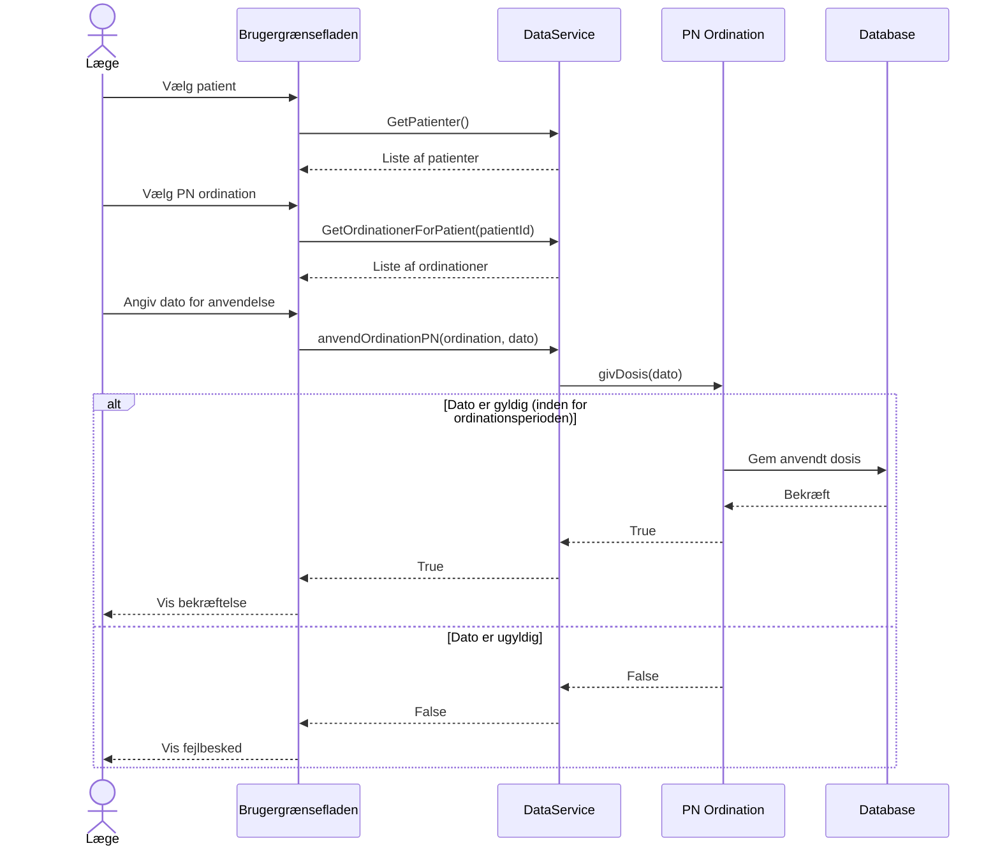
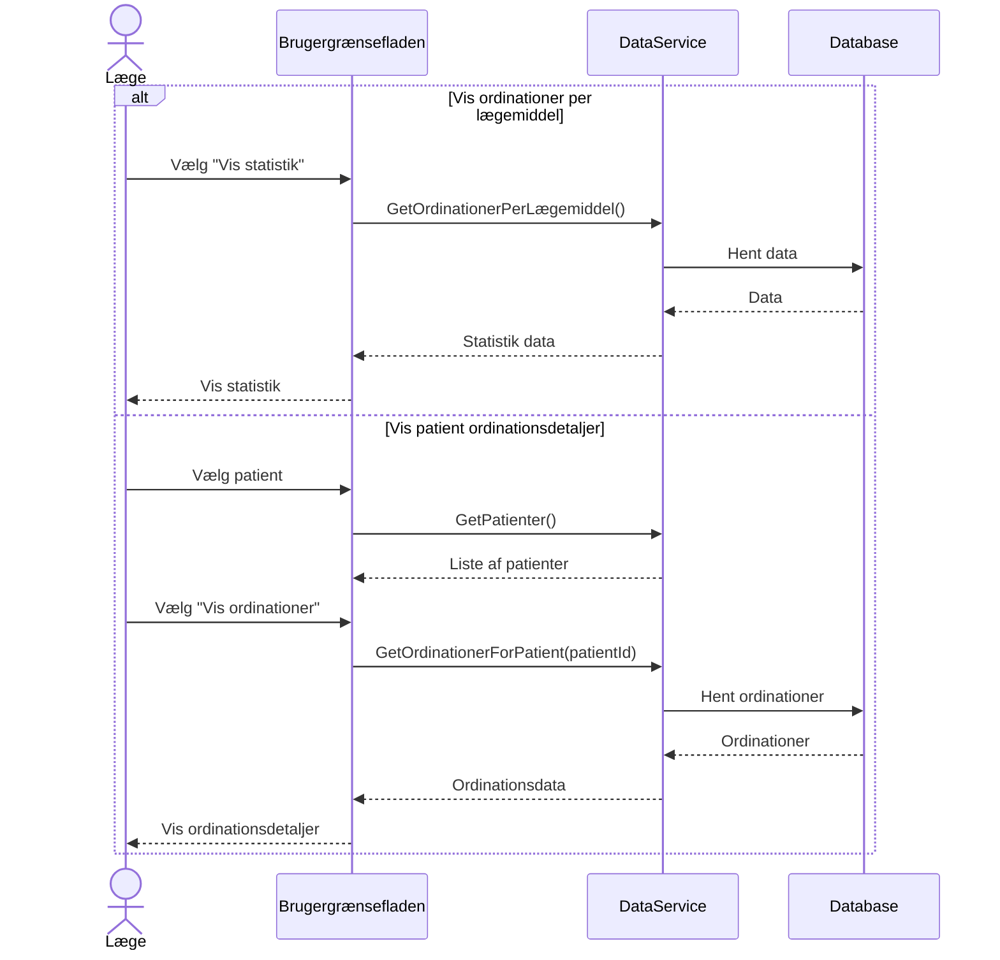

# Use Case Diagrams for Ordination System

## Use Case Overview



## UC1: Opret Patient Ordination - Sequence Diagram



## UC2: Anvend PN Ordination - Sequence Diagram



## UC3: Vis Statistik - Sequence Diagram



## Class Relationship Diagram

```mermaid
classDiagram
    class Patient {
        +string cprnr
        +string navn
        +double vægt
        +List~Ordination~ ordinationer
        +setVægt(double) bool
    }
    
    class Ordination {
        <<abstract>>
        +Dato startDato
        +Dato slutDato
        +Laegemiddel laegemiddel
        +double samletDosis()
        +double doegnDosis()
        +Dato getStartDato()
        +Dato getSlutDato()
    }
    
    class PN {
        +double antalEnheder
        +List~Dato~ dates
        +bool givDosis(Dato)
        +double doegnDosis()
        +double samletDosis()
    }
    
    class DagligFast {
        +Dosis morgen
        +Dosis middag
        +Dosis aften
        +Dosis nat
        +double doegnDosis()
        +double samletDosis()
    }
    
    class DagligSkæv {
        +List~Dosis~ doser
        +double doegnDosis()
        +double samletDosis()
    }
    
    class Laegemiddel {
        +string navn
        +double enhedPrKgPrDoegnLet
        +double enhedPrKgPrDoegnNormal
        +double enhedPrKgPrDoegnTung
        +double getEnhedPrKgPrDoegn(Patient)
    }
    
    class Dosis {
        +Dato tid
        +double antal
        +Dato getTid()
        +double getAntal()
    }
    
    class Dato {
        +int dag
        +int måned
        +int år
        +bool erFørEl(Dato)
    }
    
    Patient "1" --> "*" Ordination
    Ordination <|-- PN
    Ordination <|-- DagligFast
    Ordination <|-- DagligSkæv
    Ordination "*" --> "1" Laegemiddel
    DagligFast "*" --> "4" Dosis
    DagligSkæv "*" --> "*" Dosis
    PN "*" --> "*" Dato